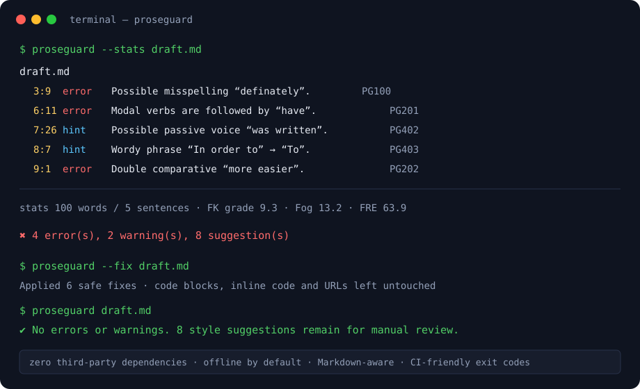

<div align="center">

# 🛡️ ProseGuard · Zero-Dependency Offline Writing Linter

**Offline-first · zero runtime dependencies · spelling, grammar, punctuation, style & readability in one tool**

[简体中文](README.md) ｜ [繁體中文](README.zh-TW.md) ｜ [English](README.en.md)


</div>

---

## 🎉 Introduction

**ProseGuard** is an **offline English writing linter** for developers and writers. One command scans Markdown, plain text, reStructuredText and LaTeX documents, pinpoints spelling mistakes, grammar errors, typographic issues, weak style and readability bottlenecks, and reports them in your choice of terminal text, JSON, Markdown or a self-contained HTML report.

- 😩 **The pain it solves**: online grammar assistants upload your text and create privacy risks; classic local tools depend on heavy language models or system libraries; and CI pipelines have lacked a **scriptable, network-free quality gate** with well-defined exit codes.
- 🧩 **Core value**: the Python standard library is all it needs — clone and run, install and use. Rules are pluggable, thresholds are configurable, and ProseGuard ships both as a CLI and as an importable library.
- ✨ **Differentiators**:
  - **Markdown-aware**: fenced code blocks, inline code, URLs, emails and HTML comments are exempt by design, and `--fix` can never erase code (guarded by regression tests).
  - **Deterministic safe fixes**: every fix is an explicit replacement, applied back-to-front with overlap resolution — repeatable and idempotent.
  - **Quantified readability**: built-in Flesch Reading Ease, Flesch–Kincaid Grade Level and Gunning Fog index, plus a syllable estimator.
  - **Engineering-friendly**: semantic `0/1/2` exit codes, machine-readable JSON output, recursive folder scans, personal dictionaries and drop-in GitHub Actions support.
- 💡 **Inspiration**: the trending offline grammar checker [Harper](https://github.com/Automattic/harper) (written in Rust). ProseGuard borrows only the *local-first, privacy-first product idea*; **100% of the code was written from scratch** in pure Python, with differentiation around Markdown handling, safe auto-fixing and CI integration.



---

## ✨ Highlights

### 🔤 Spelling
- **PG100 Common misspellings**: a built-in dictionary of **400+** frequently misspelled words (`definately → definitely`) with case-preserving fixes.
- **PG101 Repeated words**: catches lexical illusions such as `the the`, while allowing legitimate repeats like `had had`.

### 📐 Grammar
- **PG200 Article agreement**: chooses `a/an` by **sound**, including exceptions such as `an hour` and `a university`.
- **PG201 Modal + “of”**: `should of → should have`.
- **PG202 Double comparatives**: `more easier → easier`.
- **PG203 First-person pronoun**: lowercase `i → I`.
- **PG204 Third-person singular**: `he don't → he doesn't`.
- **PG205 Sentence capitalization**, with lowercase brands (`iPhone`, `eBay`, `macOS`) whitelisted to prevent false positives.

### ✒️ Punctuation & Typography
- **PG300** multiple spaces · **PG301** space before punctuation · **PG302** missing space after punctuation (numbers like `1,000` and `12:30` are ignored) · **PG303** doubled punctuation (ellipses `...` allowed) · **PG304** trailing whitespace.

### 🎩 Style
- **PG400 weasel/hedge words** and **PG401 weak intensifiers** (very / really / literally…).
- **PG402 passive voice**: detects `be + past participle` and suggests an active rewrite.
- **PG403 wordy phrases**: 70+ conciseness mappings (`in order to → to`, `due to the fact that → because`).
- **PG404 overlong sentences** and **PG405** the same opener three sentences running.

### 📊 Readability
- **PG500 dense sentences**: estimates a per-sentence Flesch–Kincaid-style grade and flags sentences above the threshold.
- `--stats` reports words, sentences, complex words, syllables, average sentence length, FRE, FK grade and Gunning Fog.

### 🧰 Engineering
- ✅ **Zero runtime dependencies** on Python 3.9+, identical behavior on Windows, macOS and Linux.
- ✅ **Four report formats**: colored terminal text, JSON, Markdown and a single-file HTML report (no external assets).
- ✅ **Safe auto-fix** (`--fix`) with an automatic re-lint pass.
- ✅ **`.proseguard.json`** for rule toggles, personal dictionaries, thresholds, extensions and excludes — discovered by walking up the directory tree.
- ✅ **Library API**: `from proseguard import Linter` for editor plugins, writing pipelines and agents.

---

## 🚀 Quick Start

### Requirements

| Item | Requirement |
| --- | --- |
| Python | **3.9 / 3.10 / 3.11 / 3.12 / 3.13** (standard library only, zero third-party runtime deps) |
| OS | Any terminal on Windows, macOS or Linux |
| Disk | Under 50 KB installed |

### Installation

```bash
# Option 1 — install straight from GitHub (git required)
pip install "git+https://github.com/gitstq/proseguard.git"

# Option 2 — clone and install in editable mode (for development)
git clone https://github.com/gitstq/proseguard.git
cd proseguard
pip install -e .

# Option 3 — run without installation (zero deps; just set PYTHONPATH)
PYTHONPATH=src python -m proseguard --version
```

> On Windows PowerShell: `$env:PYTHONPATH="src"; python -m proseguard --version`

### 30-Second Tour

```bash
# 1. List all 20 built-in rules
proseguard --list-rules

# 2. Lint a single file (exit codes: 0 clean / 1 findings / 2 runtime error)
proseguard docs/intro.md

# 3. Lint a whole tree (.git, node_modules, venv, etc. are skipped)
proseguard .

# 4. Apply safe fixes and show readability statistics
proseguard --fix --stats README.md

# 5. Pipe text through standard input
echo "This is definately wrong." | proseguard -

# 6. Export an HTML report
proseguard -f html docs/ -o report.html
```

### Use It as a Library

```python
from proseguard import Linter

linter = Linter()                       # or Linter(Config(disable={"PG400"}))
result = linter.lint_text("This is definately wrong.")

for finding in result.findings:
    line, col = finding.position(result.source)[:2]
    print(line, col, finding.rule_id, finding.message, finding.replacement)

print(result.stats.to_dict())           # readability metrics
```

---

## 📖 In-Depth Guide

### CLI Reference

| Flag | Description |
| --- | --- |
| `paths...` | Files or directories (recursive by extension); `-` means standard input |
| `-c, --config` | Explicit `.proseguard.json` (otherwise auto-discovered upwards) |
| `-f, --format` | `text` (default) / `json` / `md` / `html` |
| `-o, --output` | Write the report to a file instead of stdout |
| `--fix` | Apply safe fixes in place, then re-lint automatically |
| `--stats` | Add readability statistics to the text report |
| `--enable` | Enable only these rules (comma-separated, repeatable), e.g. `--enable PG100,PG200` |
| `--disable` | Turn rules off, e.g. `--disable PG400,PG401` |
| `--ext` | Extensions scanned in folders (default `.md,.markdown,.txt,.rst,.tex`) |
| `--exclude` | Directory names/globs to skip (repeatable) |
| `--max-sentence-words` | Override the PG404 soft limit (default 25) |
| `--color` | `auto` (default) / `always` / `never` |
| `--encoding` | Source encoding (default `utf-8`) |
| `--stdin-filename` | Label to display for stdin input |
| `--list-rules` | Print the rule catalog and exit |
| `-V, --version` | Print the version |

### Built-in Rule Catalog

| ID | Severity | Category | Meaning | Auto-fix |
| --- | --- | --- | --- | --- |
| PG100 | error | spelling | Common misspelling | ✅ |
| PG101 | error | spelling | Accidental repeated word | ✅ |
| PG200 | error | grammar | a/an article agreement | ✅ |
| PG201 | error | grammar | Modal verb followed by “of” | ✅ |
| PG202 | error | grammar | Double comparative | ✅ |
| PG203 | error | grammar | Lowercase first-person pronoun | ✅ |
| PG204 | error | grammar | Third-person singular “don't” | ✅ |
| PG205 | suggestion | grammar | Sentence not capitalized | ✅ |
| PG300 | warning | punctuation | Consecutive spaces | ✅ |
| PG301 | warning | punctuation | Space before punctuation | ✅ |
| PG302 | warning | punctuation | Missing space after punctuation | ✅ |
| PG303 | suggestion | punctuation | Doubled punctuation | ✅ |
| PG304 | warning | punctuation | Trailing whitespace | ✅ |
| PG400 | suggestion | style | Weasel / hedge word | ❌ |
| PG401 | suggestion | style | Weak intensifier | ❌ |
| PG402 | suggestion | style | Possible passive voice | ❌ |
| PG403 | suggestion | style | Wordy phrase | ✅ |
| PG404 | suggestion | style | Overlong sentence | ❌ |
| PG405 | suggestion | style | Repeated sentence opener | ❌ |
| PG500 | suggestion | readability | Dense, hard-to-read sentence | ❌ |

### Configuration: `.proseguard.json`

Config discovery starts at each target file's directory and walks **upwards**; CLI flags always win over the config file.

```json
{
  "disable": ["PG400", "PG401"],
  "enable": [],
  "max_sentence_words": 28,
  "long_sentence_hard": 40,
  "readability_grade": 12,
  "personal_dictionary": ["proseguard", "pythonic"],
  "extensions": [".md", ".txt", ".rst"],
  "excludes": ["draft", "vendor"]
}
```

- `personal_dictionary`: project terms and coined words (lower-case) permanently exempted from PG100.
- A non-empty `enable` switches to **allow-list mode**: only listed rules run.

### Recipes

**Recipe 1 — a documentation gate in pull requests**

```bash
proseguard -f json docs/ > proseguard-report.json
# Exit code 1 on any error-level finding — fail the merge directly
```

**Recipe 2 — hard spelling/grammar checks only**

```bash
proseguard --enable PG100,PG101,PG200,PG201,PG202,PG203,PG204,PG205 .
```

**Recipe 3 — batch safe fixes, then manual polish**

```bash
proseguard --fix .          # deterministic problems fixed in one pass
proseguard --stats .        # remaining style hints and readability metrics
```

### JSON Output (excerpt)

```json
{
  "files": [{
    "path": "intro.md",
    "findings": [{
      "rule_id": "PG100",
      "severity": "error",
      "category": "spelling",
      "start_line": 3, "start_column": 9,
      "message": "Possible misspelling “definately”. Did you mean “definitely”?",
      "replacement": "definitely",
      "autofixable": true
    }],
    "stats": { "words": 100, "sentences": 5, "flesch_kincaid_grade": 9.3 }
  }],
  "summary": { "error": 1, "warning": 0, "suggestion": 3 }
}
```

### Screenshots & Demo

- Terminal illustration: [`docs/demo.svg`](docs/demo.svg) at the top of the repo.
- Try the bundled sample yourself: `proseguard --stats examples/bad_writing.md`.
- A full terminal recording will be added at `docs/demo.gif` in a later release.

---

## 💡 Design Notes & Roadmap

### Architecture

```
proseguard/
├── src/proseguard/
│   ├── tokenizer.py     # sentence/word splitting + equal-length Markdown masking
│   ├── dictionaries.py  # misspellings, wordy phrases, participles, sound exceptions
│   ├── rules/           # five rule families: spelling/grammar/punctuation/style/readability
│   ├── engine.py        # rule orchestration, protected-range filtering, stats
│   ├── autofix.py       # deterministic fixes: overlap resolution, back-to-front edits
│   ├── report.py        # text / json / markdown / html formatters
│   ├── config.py        # .proseguard.json discovery, merging and validation
│   └── cli.py           # argparse command-line entry point
└── tests/               # 73 unittest cases, no third-party test dependencies
```

### Why these choices?

1. **Standard library only.** A writing linter's value lives in its rules and corpora, not its dependency tree. Zero dependencies means instant install on any CI runner, offline server or air-gapped intranet.
2. **Equal-length masking, never deletion.** Code and URLs are replaced by same-length spaces before linting, so line/column coordinates align exactly with the source and auto-fixing cannot corrupt code.
3. **Rules as data.** Every rule declares id/severity/category/fixability; the catalog, config toggles and reporters all consume the same metadata.
4. **Conservative by design.** Context-dependent calls (`there/their`, `its/it's`) are intentionally left out to keep false-positive rates low and output trustworthy.

### Roadmap

- [ ] v1.1: `--watch` mode and a minimal LSP server for real-time editor diagnostics.
- [ ] v1.2: Pluggable custom rules via Python entry points.
- [ ] v1.3: British/American spelling variants and CSV personal-dictionary import.
- [ ] v1.4: SARIF output for the GitHub code-scanning panel.
- [ ] v2.0: Optional local model backend (offline, opt-in) for context-level grammar.

### Good first contributions

New misspellings, additional wordy-phrase mappings, syllable-counter improvements, localized messages and translated docs are all very welcome.

---

## 📦 Packaging & Deployment

ProseGuard is a **library / CLI project** (pure Python, interpreted cross-platform), so no platform-specific binaries are required.

### Build distribution artifacts from source

```bash
python -m pip install build
python -m build           # produces dist/*.tar.gz and a py3-none-any wheel
pip install dist/proseguard-1.0.0-py3-none-any.whl
```

### GitHub Actions integration

```yaml
name: Docs prose check
on: [pull_request]
jobs:
  proseguard:
    runs-on: ubuntu-latest
    steps:
      - uses: actions/checkout@v4
      - uses: actions/setup-python@v5
        with: { python-version: "3.12" }
      - run: pip install "git+https://github.com/gitstq/proseguard.git"
      - run: proseguard --format json docs/ -o proseguard.json
      - uses: actions/upload-artifact@v4
        with: { name: proseguard-report, path: proseguard.json }
```

### Compatibility & Scope

- UTF-8 input is expected; pass `--encoding` for other encodings.
- The linter targets **English** prose. CJK text is never flagged as misspelled because the tokenizer only recognizes Latin-letter tokens.
- No network calls are ever made; the HTML report is a single file with no external references.

---

## 🤝 Contributing

Issues, PRs and dictionary additions are welcome — see [CONTRIBUTING.md](CONTRIBUTING.md) for the full guide. The essentials:

1. **Fork → feature branch**, named like `feat/xxx`, `fix/xxx`, `docs/xxx`.
2. **Angular-style commits**: `feat:` / `fix:` / `docs:` / `refactor:` / `test:` / `chore:`.
3. **Tests are mandatory** for new rules (positive + negative cases):
   ```bash
   make test          # == PYTHONPATH=src python -m unittest discover -s tests -v
   ```
4. **The zero-dependency rule is strict**: no third-party runtime packages without a prior Issue discussion.
5. **False-positive reports** should include the source snippet, expected behavior and `proseguard --version` output.

---

## ❓ FAQ

**Does it upload my documents anywhere?**
No. ProseGuard runs fully offline, makes zero network requests and its source is auditable.

**Why don't you check confusions like there/their?**
They require real context understanding and produce costly false positives. ProseGuard stays conservative and plans to offer them via the opt-in model backend.

**Can `--fix` corrupt my code blocks?**
No. Fenced blocks, inline code and link URLs are masked before linting, and the dedicated regression test `test_fix_never_erases_protected_code_or_links` enforces this.

**How do I block only errors in CI and ignore suggestions?**
Use the `--enable` allow-list, or consume the JSON output and decide by `severity`.

---

## 📄 License

Released under the **[MIT License](LICENSE)** — free for personal and commercial use, just retain the copyright notice.

<div align="center">

⭐ If ProseGuard helps keep your prose clean, a Star is much appreciated!

</div>
